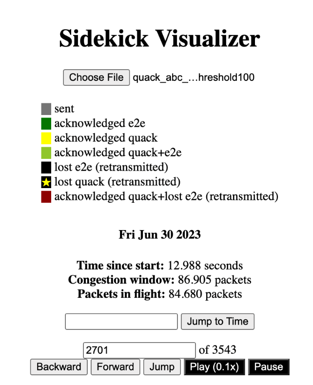
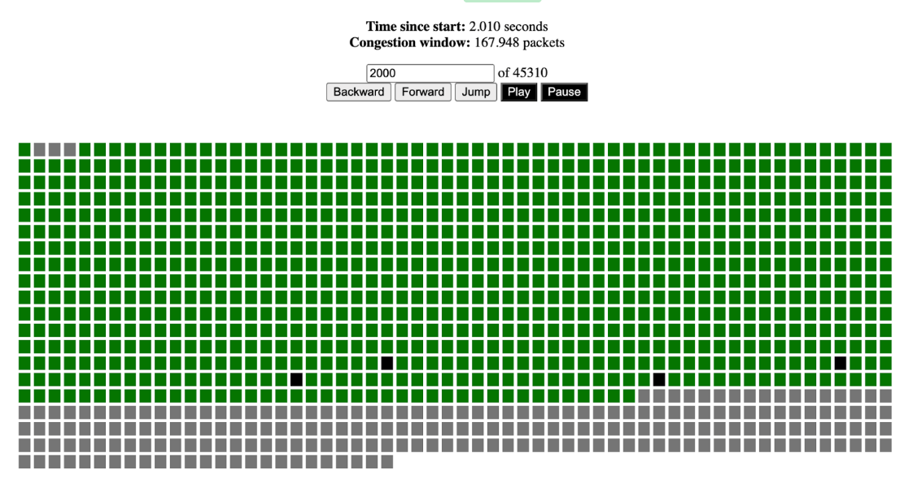
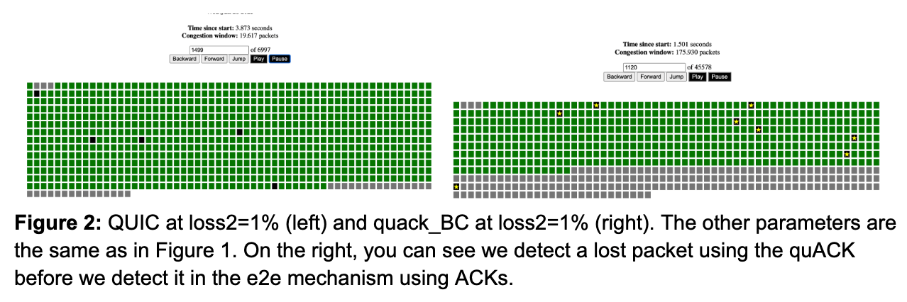
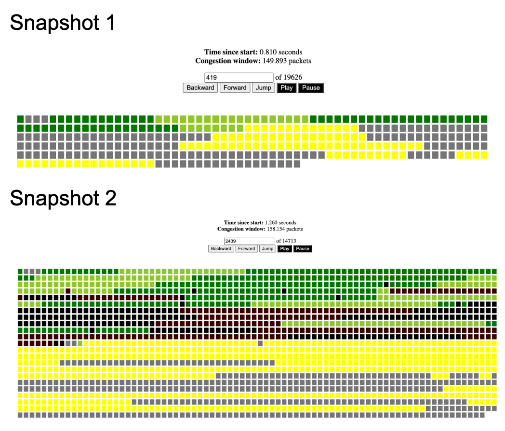
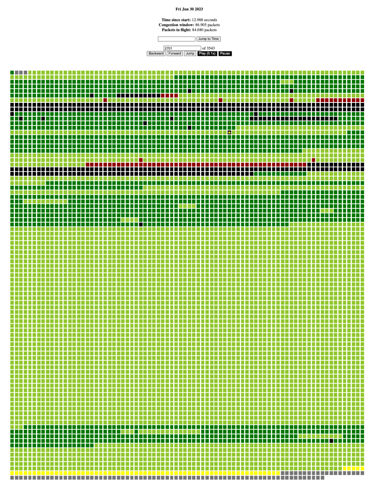

# Visualizer

This visualizer was created initially to debug issues in the flow control
mechanism of the ACK reduction scenario. It visualizes the perspective of
the data sender in an HTTP/3+QUIC connection, including which packets have
been sent and are outstanding, and which packets have been ACKed, quACKed,
determined to be lost, or otherwise.
_Disclaimer: The program has not been maintained since then._ (6/30/23)

Enable debug logging for the visualizer by building the HTTP/3 client,
in this case the `quiche` library linked to the `libcurl` client, with
the `debug` feature in the crate. Run a mininet emulation experiment and
save the stderr logs to a log file. Open `index.html` in a browser and
load the log file. Use the buttons on the page to playback the file, or
analyze the file frame-by-frame.

## Examples

_Disclaimer: These comments are copied directly from my notes, and
represent an exploration of path-aware sender behavior in the case of
a lossy, low-latency link on the near path segment and a reliable,
high-latency link on the far path segment._

A, B, and C are three path-aware sender behaviors we implemented in
`quiche` that can be toggled on and off based on the the application
objective:

* A. Use quACKed packets to open up the flow control window (necessarily with C).
* B. Detect lost packets (reordering threshold = 1) and retransmit i.e. Tahoe fast retransmit.
* C. Update the congestion window proportionally to the ratio of near path segment RTT
to total RTT based on packets determined to be received by or lost on the way to the proxy.

**Figure 1:** QUIC at loss2=0%, delay1=75ms, delay2=1ms, bw1=10Mb/s, bw2=100Mb/s.
Only gray, dark green, and black. Lagging about 200 packets (BDP + queue)
behind what is acked. Occasionally the e2e mechanism will discover a small
number of packets dropped. This causes the cwnd to drop.

**Figure 2:** QUIC at loss2=1% (left) and quack_BC at loss2=1% (right).
The other parameters are the same as in Figure 1. On the right, you can see we
detect a lost packet using the quACK before we detect it in the e2e mechanism
using ACKs. The cwnd in end-to-end QUIC is much lower.

**Figure 3:** quack_ABC with the same network parameters as Figure 2. If the
bottleneck is on the far subpath, then necessarily we should not be using
the near subpath quACKs for increasing the cwnd. Since even if we can
accurately detect the quACKed packets, we don't know what will happen to them
on the far subpath.

**Figure 4:** We can see the cwnd reaches a stable state after the first 5 seconds.
